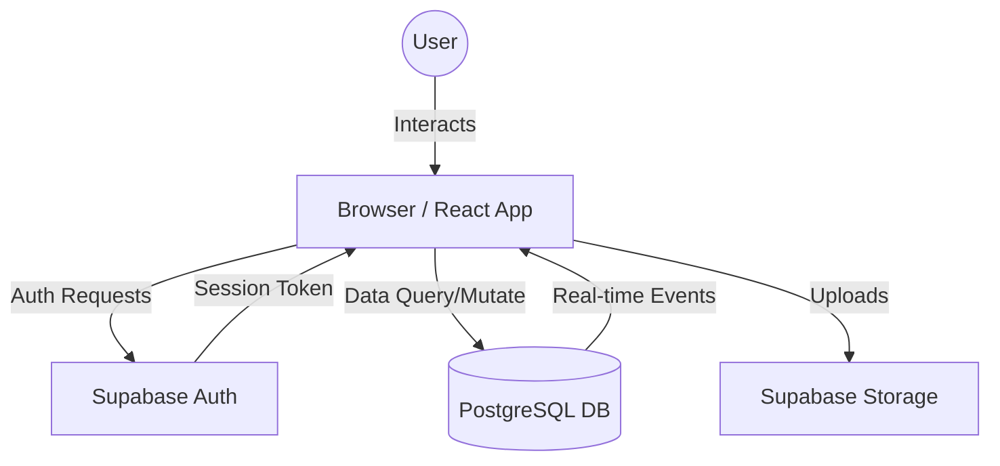

# Next Up: Comprehensive Project Documentation & Technical Reference

Welcome to the internal documentation for **Next Up**. This document is designed to provide a deep technical understanding of the project's architecture, implementation details, and the reasoning behind development choices. It serves as both a reference for developers and a learning guide for those looking to understand how modern marketplace applications are built.

---

## 1. Project Vision & Overview

### **What is Next Up?**
Next Up is a modern, high-performance C2C (Consumer-to-Consumer) marketplace platform. It allows users to list products, browse various categories, and engage in real-time communication to finalize deals. The primary goal is to provide a seamless, secure, and instant trading experience, bridging the gap between local buyers and sellers.

### **Target Audience**
*   **Individual Sellers**: People looking for a fast way to sell new or used items without middleman fees.
*   **Budget-Conscious Buyers**: Users seeking great local deals on electronics, furniture, apparel, etc.
*   **Aspiring Developers**: Individuals studying full-stack React applications with serverless backends.

---

## 2. Technical Ecosystem (Tech Stack)

The project leverages cutting-edge web technologies to ensure a fast, responsive, and scalable experience.

| Technology | Purpose | Key Benefit |
| :--- | :--- | :--- |
| **React 19** | Frontend UI | Component-based, fast rendering with the latest features. |
| **Vite** | Build Tooling | Lightning-fast development server and optimized production builds. |
| **Supabase** | Backend (BaaS) | Postgres database, Auth, Storage, and Real-time out of the box. |
| **Tailwind CSS 4** | Styling | Utility-first CSS for rapid, consistent, and responsive design. |
| **React Router 7** | Routing | Client-side navigation with support for protected routes. |
| **Lucide React** | Icons | Modern, lightweight, and customizable icon set. |

---

## 3. Project Architecture

Next Up follows a **Single Page Application (SPA)** architecture with a decoupled Backend-as-a-Service (BaaS) layer.

### **Component-Driven Development**
The frontend is built using reusable functional components. State management is primarily handled via React Hooks and Context API for global state like Authentication.

### **Data Flow Architecture**

---

## 4. Core Features Deep Dive

### **A. Authentication & Identity (`useAuth`)**
The `useAuth` hook is the heart of the application's security. It manages the user session, providing login, signup, and logout functionalities across the entire app.

*   **Mechanism**: Uses Supabase GoTrue for email/password and OAuth (Google).
*   **Security**: Stores JWTs in LocalStorage and uses `onAuthStateChange` to react to session changes instantly.
*   **Implementation Note**: The `AuthProvider` wraps the entire app in `main.jsx`, ensuring that authentication state is available everywhere.

### **B. Real-Time Chat System**
Next Up features a sophisticated chat system that doesn't require page refreshes to receive new messages.

*   **Technology**: Built using Supabase Real-time (WebSockets).
*   **Logic**:
    1.  User enters a conversation.
    2.  The app "subscribes" to the `messages` table filtered by the current `conversation_id`.
    3.  When a peer sends a message (inserts a row), Supabase pushes the change to the subscriber.
    4.  The UI updates immediately.

### **C. Marketplace Logic (Discovery & Listing)**
*   **Filtering**: Advanced search and category filtering are performed server-side for performance.
*   **Product Addition**: Handles multi-part forms (metadata + image upload). Images are stored in Supabase Buckets, and public URLs are saved in the database.

---

## 5. Learning Guide: How to Build This Project

If you are reading this to learn how to create a project like Next Up, follow these logical steps:

### **Phase 1: Foundation (Setup)**
1.  **Initialize Vite-React**: `npm create vite@latest nextup -- --template react`
2.  **Configure Tailwind**: Install and setup Tailwind CSS for styling.
3.  **Supabase Client**: Create a `lib/supabase.js` file to initialize the connection using your Project URL and Anon Key.

### **Phase 2: Identity (Authentication)**
1.  **Create Auth Context**: Build a `useAuth` hook and `AuthProvider` component.
2.  **UI Screens**: Build `SignIn.jsx` and `SignUp.jsx`.
3.  **Protected Routes**: Create a `ProtectedRoute` component to wrap sensitive pages (Profile, Messages).

### **Phase 3: Core Logic (Database & CRUD)**
1.  **Data Design**: Define your tables via the Supabase Dashboard (Profiles, Products, Conversations, Messages).
2.  **Listings**: Create a page to fetch and display products using `supabase.from('products').select('*')`.
3.  **Creation**: Implement a form to `insert` new products, including file uploads for images.

### **Phase 4: Communication (Real-time)**
1.  **Chat UI**: Build the message thread interface.
2.  **Real-time Subscription**: Use `supabase.channel()` to listen for new rows in the `messages` table.

---

## 6. Project Roadmap (Future Roadmap)

- [ ] **Payments Integration**: Secure escrow or Stripe integration.
- [ ] **Push Notifications**: Notify users of new messages when the app is closed.
- [ ] **Advanced Analytics**: Seller dashboards to track product views.
- [ ] **PWA Support**: Allow users to install the web app on their mobile devices.

---

## Conclusion

Next Up is designed to be a robust, high-performance starting point for a modern marketplace. By combining the power of **React 19** with the utility of **Supabase**, it achieves features that previously required complex server-side orchestration—all while maintaining an easy-to-understand codebase.

> [!TIP]
> To truly master this project, dive into `src/pages/Messages.jsx` to see how real-time subscriptions are managed, as this is the most advanced technical component of the application.

---
*Created for: Educational and Production Reference*
