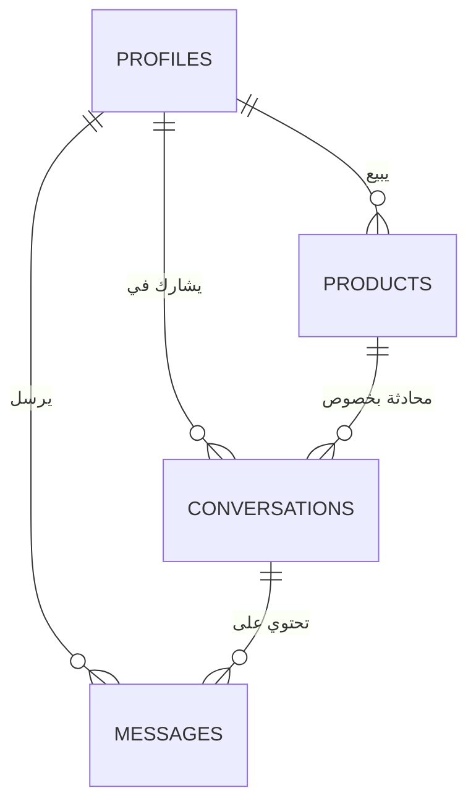

# توثيق المشروع التقني: Next Up (المرجع الشامل)

## 1. نظرة عامة على المشروع (Project Overview)

**اسم المشروع**: Next Up  
**النوع**: منصة سوق إلكتروني (Marketplace) من المستهلك للمستهلك (C2C).  
**التقنيات المستخدمة (Tech Stack)**: React 19, Vite, Supabase, Tailwind CSS 4.

### **ماذا يفعل المشروع؟**
تطبيق "Next Up" هو منصة ويب حديثة وسريعة الاستجابة (Responsive) تهدف إلى تسهيل عمليات البيع والشراء للمنتجات الجديدة والمستعملة. يعمل التطبيق كوسيط تقني بين البائعين (Sellers) والمشترين (Buyers)، حيث يسمح للمستخدمين برفع إعلانات لمنتجاتهم، وتصفح الأقسام المختلفة، والتواصل بشكل مباشر وآمن من خلال نظام دردشة فوري (Real-time Chat) مدمج داخل الموقع.

### **الجمهور المستهدف (Target Users)**
*   **البائعون (Sellers)**: الأفراد الذين يرغبون في بيع مقتنياتهم الشخصية (إلكترونيات، أثاث، ملابس) بطريقة سهلة وآمنة دون الحاجة لوسطاء.
*   **المشترون (Buyers)**: المستخدمون الذين يبحثون عن صفقات جيدة في مناطقهم الجغرافية.
*   **الطلاب والمجتمع المحلي**: الفئة الأكثر استفادة من التبادل التجاري المحلي السريع.

### **المشكلة التي يحلها (Problem Solving)**
الأسواق التقليدية (مثل الجروبات العشوائية على فيسبوك) تعاني من الفوضى، وصعوبة البحث، وانعدام الخصوصية حيث يضطر الطرفان للخروج من المنصة (إلى WhatsApp مثلاً) للتفاوض، مما يعرض أرقامهم للخطر.
**الحل هنا**: يوفر Next Up بيئة متكاملة؛ فالبحث، والفلترة، والمفضلة، والدردشة، كلها تتم في مكان واحد آمن ومحمي.

---

## 2. هيكلية النظام (Architecture Overview)

يعتمد المشروع على معمارية **تطبيقات الصفحة الواحدة (Single Page Application - SPA)**، وهي أحدث ما توصلت إليه تقنيات الويب، حيث يتم تحميل الموقع مرة واحدة، وبعدها يتم تغيير المحتوى ديناميكيًا دون إعادة تحميل الصفحة، مما يعطي تجربة مستخدم (UX) فائقة السرعة تشبه تطبيقات الموبايل.

### **أ. واجهة المستخدم (Frontend Architecture)**
*   **React 19**: المكتبة الأساسية لبناء الواجهات. تعتمد على نظام المكونات (Components)، مما يعني أن كل جزء في الموقع (زر، قائمة، بطاقة منتج) هو كود منفصل قابل لإعادة الاستخدام.
*   **Vite**: أداة البناء (Build Tool). تم اختيارها لأنها أسرع بعشرات المرات من الأدوات القديمة (مثل Webpack)، وتوفر خاصية التحديث الفوري (Hot Module Replacement) أثناء التطوير.
*   **Client-Side Rendering (CSR)**: المتصفح هو من يقوم بمعالجة الكود ورسم الشاشات، مما يخفف الحمل عن السيرفر.

### **ب. والخدمات الخلفية (Backend / BaaS)**
بدلاً من بناء سيرفر تقليدي (Node.js/Express) قد يكون مكلفًا ومعقدًا في الصيانة، تم استخدام **Supabase** كخدمة خلفية (Backend-as-a-Service).
*   **قاعدة البيانات**: PostgreSQL (أقوى قواعد البيانات العلائقية في العالم).
*   **المصادقة (Auth)**: إدارة المستخدمين (تسجيل دخول/خروج) جاهزة وآمنة.
*   **الوقت الفعلي (Realtime)**: ميزة قوية جدًا في Supabase تسمح بفتح قنوات اتصال (WebSockets) لنقل الرسائل فورًا بين المستخدمين.

### **لماذا اخترنا هذه المعمارية؟**
1.  **السرعة والأداء**: الاتصال المباشر بين المتصفح و Supabase يقلل من زمن الاستجابة (Latency).
2.  **التكلفة**: لا نحتاج لاستئجار سيرفرات backend مكلفة؛ Supabase يتكفل بكل شيء.
3.  **قابلية التوسع (Scalability)**: النظام مبني للتعامل مع آلاف المستخدمين دون تغيير في الكود.

### **رسم توضيحي للمعمارية**
```mermaid
graph TD
    Client[المتصفح (React Client)]
    Supabase[خدمة Supabase السحابية]
    Auth[نظام المصادقة Auth]
    DB[(قاعدة البيانات Postgres)]
    Realtime[محرك الوقت الفعلي]
    
    Client -->|طلب بيانات| Supabase
    Supabase --> Auth
    Supabase --> DB
    Supabase --> Realtime
    Realtime -->|تحديث فوري (WebSockets)| Client
```

---

## 3. تفصيل الملفات والمجلدات (Folder & File Breakdown)

هنا سنشرح كل ملف في المشروع ولماذا هو موجود، لتكون فاهمًا لكل سطر كود.

### **المجلد الرئيسي (Root)**
1.  `package.json`:
    *   **وظيفته**: "بطاقة هوية المشروع". يحتوي على قائمة المكتبات المثبتة وأوامر التشغيل.
    *   **أهم المكتبات**: `@supabase/supabase-js` (للاتصال بالقاعدة)، `react-router-dom` (للتنقل بين الصفحات)، `tailwindcss` (للتصميم).
2.  `.env`:
    *   **وظيفته**: مخزن الأسرار. نضع فيه مفاتيح الاتصال بـ Supabase (`API KEYS`).
    *   **تنبيه أمني**: هذا الملف لا يُرفع أبدًا على GitHub لحماية المشروع من الاختراق.

### **مجلد `src/` (الكود المصدري)**

#### **الملفات الأساسية**
*   `main.jsx`: نقطة البداية. هنا يتم "حقن" تطبيق React داخل صفحة الـ HTML. يتم هنا تغليف التطبيق بـ `AuthProvider` (ليعرف التطبيق من هو المستخدم المسجل) و `BrowserRouter` (لتفعيل التنقل).
*   `App.jsx`: "شرطي المرور". يحدد المسارات (Routes)؛ فمثلاً إذا كتب المستخدم `/login` سيقوم هذا الملف بعرض صفحة `Login.jsx`.
*   `index.css`: ملف التنسيقات العامة، وتجهيز مكتبة Tailwind.

#### **مجلد `src/auth/` (نظام الدخول)**
*   `signIn.jsx`: صفحة تسجيل الدخول. تحتوي على نموذج (Form) يرسل البريد وكلمة المرور إلى Supabase للتحقق.
*   `signUp.jsx`: صفحة إنشاء الحساب الجديد. تقوم بإنشاء مستخدم في جدول `auth.users` وتوجيهه.

#### **مجلد `src/components/` (المكونات)**
*   `Header.jsx` (**هام جداً**):
    *   هذا ليس مجرد شريط علوي؛ هو "لوحة تحكم مصغرة".
    *   يحتوي على: التنقل، البحث، وكود ذكي يستمع (Listen) لـ Supabase Realtime ليعرض "نقطة حمراء" عند وصول رسالة جديدة.
*   `ProtectedRoute.jsx`:
    *   **وظيفته (Security)**: حارس أمني. يوضع حول الصفحات الخاصة (مثل "رسائلي"). إذا حاول شخص غير مسجل الدخول الوصول إليها، يقوم هذا الملف بطرده وإعادته لصفحة الدخول.

#### **مجلد `src/pages/` (الصفحات)**
*   `products.jsx` (صفحة التصفح):
    *   تعرض شبكة المنتجات (Grid).
    *   تحتوي على منطق "الفلترة" المعقد (بالسعر، بالفئة، بالبحث) وتنفذه مباشرة على قاعدة البيانات لضمان السرعة.
*   `ProductDetails.jsx` (تفاصيل المنتج):
    *   تعرض الصور والسعر.
    *   تحتوي على الزر السحري **"Chat with Seller"**. هذا الزر يقوم بفحص ذكي: "هل توجد محادثة سابقة بيني وبين البائع حول هذا المنتج؟" إذا نعم، يفتحها. إذا لا، ينشئ محادثة جديدة.
*   `Messages.jsx` (نظام الدردشة):
    *   أعقد ملف في المشروع. يدير قائمة المحادثات، ويعرض الرسائل، ويستقبل التحديثات الفورية.
*   `addProducts.jsx`:
    *   صفحة إضافة إعلان. تتعامل مع شيئين: رفع الصورة إلى `Supabase Storage` (تخزين الملفات)، وحفظ بيانات المنتج النصية في قاعدة البيانات.

---

## 4. نظام المصادقة والأمان (Authentication Deep Dive)

كيف يعرف الموقع أنك "محمد" ولست "أحمد"؟

### **آلية العمل (The Flow)**
1.  **تسجيل الدخول**: عندما تدخل الباسورد، Supabase تتحقق منه وتُصدر لك "تصريح مرور" إلكتروني يسمى **JWT (JSON Web Token)**.
2.  **التخزين الآمن**: يتم حفظ هذا التوكن في متصفح المستخدم (Local Storage) بشكل مشفر.
3.  **الجلسة (Session)**: هوك `useAuth.jsx` يراقب هذا التوكن. طالما هو صالح، يسمح لك بالتجول في الموقع.
4.  **الحماية (RLS)**: حتى لو سرق أحدهم التوكن، قاعدة البيانات محمية بقوانين **Row Level Security**. هذه القوانين تقول: "لا أحد يحذف هذا المنتج إلا صاحبه". هذا التحقق يتم في قاعدة البيانات نفسها، وليس في كود الواجهة فقط، مما يجعله أماناً من الدرجة العسكرية.

---

## 5. تصميم قاعدة البيانات (Database Design)

تم تصميم الجداول بعناية لضمان الأداء العالي وعدم تكرار البيانات.

### **الجداول (Tables)**
1.  **`profiles` (الملفات الشخصية)**:
    *   مربوط بجدول المستخدمين السري. يحتوي على الاسم العام، ورقم الهاتف، والصورة.
2.  **`products` (المنتجات)**:
    *   `prices`, `images`, `description`.
    *   كل منتج "ينتمي" لملف شخصي (Foreign Key to Profiles).
3.  **`conversations` (غرف المحادثة)**:
    *   جدول عبقري لربط العلاقات. يربط `user1` (المشتري)، `user2` (البائع)، و `product_id` (المنتج).
    *   هذا يضمن تنظيم المحادثات حسب المنتج، وليس فقط حسب الأشخاص.
4.  **`messages` (الرسائل)**:
    *   تحتوي على النص، وتاريخ الإرسال. كل رسالة تابعة لـ `conversation`.

### **المخطط البياني (ER Diagram)**


---

## 6. نظام الدردشة المبتكر (Chat Architecture) - هام جداً

هذا هو "جوهرة" المشروع. كيف تعمل الدردشة بهذه السرعة؟

1.  **بدون تحديث (No Refresh)**: في المواقع القديمة، عليك عمل Refresh لترى الرسالة الجديدة. هنا نستخدم تقنية **WebSockets**.
2.  **الاشتراك (Subscription)**: بمجرد دخولك صفحة الرسائل، الكود يقول لـ Supabase: "من فضلك، نبهني فوراً إذا تمت إضافة أي سطر جديد في جدول الرسائل (Messages Table)".
3.  **الاستجابة الفورية**: 
    *   الطرف (أ) يرسل رسالة -> يتم حفظها في القاعدة.
    *   قاعدة البيانات تطلق "حدث" (Event).
    *   الطرف (ب) يستقبل الحدث في أجزاء من الثانية وتظهر الرسالة أمامه.

### **دورة حياة الرسالة**
```mermaid
graph TD
    A[المستخدم يكتب رسالة ويضغط إرسال] --> B[إرسال الطلب لـ Supabase]
    B --> C[حفظ الرسالة في قاعدة البيانات]
    C --> D[قاعدة البيانات تطلق تنبيه Realtime]
    D --> E[المستقبل (والمرسل) يلتقط التنبيه]
    E --> F[تحديث الشاشة فوراً بدون Refresh]
```

---

## 7. التقييم النهائي للمشروع

### **نقاط القوة (Strengths)**
1.  **احترافي (Production Ready)**: المشروع ليس مجرد "واجب جامعي"، بل هو نواة لمشروع تجاري حقيقي.
2.  **الأمان العالي**: الاعتماد على RLS يعني أنه من المستحيل اختراق بيانات المستخدمين بالطرق التقليدية.
3.  **تجربة المستخدم (UX)**: التصميم هادئ (Minimalist)، وسريع الاستجابة.

### **قابلية التوسع (Scalability)**
*   قواعد بيانات Postgres تتحمل الملايين من السجلات.
*   نظام تخزين الصور (Storage) منفصل عن قاعدة البيانات، مما يعني أن الصور لن تبطئ الموقع مهما كثرت.

---

### **كيف تدرس هذا المشروع؟**
1.  ابدأ بقراءة `App.jsx` لتفهم الخريطة.
2.  ادرس `useAuth.jsx` لتفهم كيف يتم التعامل مع المستخدم.
3.  تعمق في `Messages.jsx` لتفهم السحر الحقيقي للوقت الفعلي.

--- 
**تم إعداد هذا التوثيق ليكون مرجعاً تقنياً وأكاديمياً شاملاً.**
